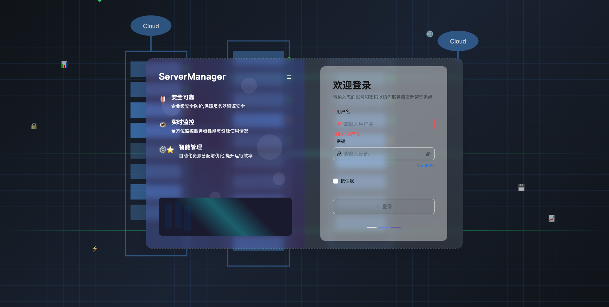
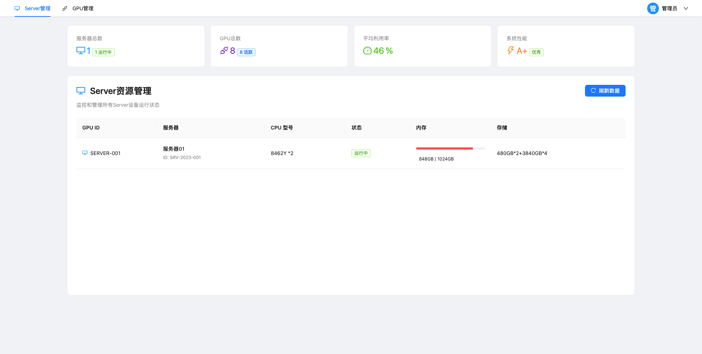

# ServerManager - 服务器资源管理系统

一个基于 Vue 3 和 Ant Design Vue 的现代化服务器资源管理系统，提供服务器和 GPU 资源的实时监控与管理功能。

## 🖼️ 界面预览

### 登录页面


### 主控台页面


## 🛠️ 技术栈

- **Vue 3** - 渐进式 JavaScript 框架
- **Ant Design Vue** - 企业级 UI 组件库
- **Vite** - 下一代前端构建工具
- **Vue Router** - 官方路由管理器

## 🎯 核心功能

### 1. 登录认证
- 用户名密码验证 (默认账号: admin / #Aa123456)
- 记住我功能
- 响应式登录界面设计
- 动态背景效果

### 2. 服务器资源管理
- 实时监控服务器运行状态
- CPU 型号展示
- 内存使用情况可视化
- 存储容量显示
- 服务器状态标签 (运行中/维护中/离线)

### 3. GPU 资源管理
- GPU 设备列表展示
- 实时利用率监控
- 内存使用情况显示
- Persistence Mode 状态
- Display Active 状态

### 4. 数据统计
- 服务器总数与运行状态统计
- GPU 总数与活跃状态统计
- 平均利用率计算
- 系统性能评分

## 🚀 快速开始

### 安装依赖
```bash
npm install
```

### 启动开发服务器
```bash
npm run dev
```

### 构建生产版本
```bash
npm run build
```

## 📁 项目结构

```
src/
├── views/
│   ├── Login/                 # 登录页面
│   │   └── index.vue          # 登录组件
│   └── Home/                  # 主页面
│       ├── components/        # 页面组件
│       │   ├── TopNavigation/ # 顶部导航
│       │   ├── ServerManagement/ # 服务器管理
│       │   └── GPUManagement/ # GPU 管理
│       ├── mock/              # 模拟数据
│       │   └── data.json      # 示例数据
│       └── index.vue          # 主页组件
├── components/                # 公共组件
│   └── ServerBackground/      # 服务器背景组件
├── utils/                     # 工具函数
└── assets/                    # 静态资源
```

## 🎨 设计亮点

### 登录页面
- 左右分栏设计，左侧功能介绍，右侧登录表单
- 动态浮动几何图形背景
- 光效流动动画
- 渐变叠加层效果
- 响应式服务器机架可视化

### 主控台页面
- 顶部导航栏，支持 Server/GPU 页面切换
- 四个数据统计卡片，展示关键指标
- 表格形式展示服务器/GPU 详细信息
- 进度条可视化资源使用情况
- 状态标签颜色区分不同状态
- 页面切换动画效果

## 🔧 开发指南

### 添加新的资源管理模块
1. 在 `src/views/Home/components/` 下创建新模块文件夹
2. 创建模块组件，参考 `ServerManagement` 或 `GPUManagement`
3. 在 `src/views/Home/index.vue` 中导入并注册组件
4. 在 `TopNavigation` 组件中添加菜单项
5. 更新 mock 数据以支持新模块

### 自定义数据源
1. 修改各组件中的 `fetchData` 方法
2. 替换模拟 API 调用为实际后端接口
3. 调整数据转换逻辑以匹配实际接口返回格式

### 样式定制
1. 修改组件中的样式部分
2. 使用 Ant Design Vue 的设计令牌保持一致性
3. 注意响应式设计，确保在不同设备上正常显示

## 📝 代码规范

### 组件规范
- 使用 Composition API
- 组件命名遵循 PascalCase
- 使用单文件组件 (SFC) 结构
- 明确的 Props 和 Emits 定义

### 样式管理
- 使用 scoped CSS 防止样式污染
- 基于 Ant Design 设计系统
- 响应式布局适配不同屏幕尺寸
- 动画效果增强用户体验

### 状态管理
- 使用 Vue 3 的响应式 API
- 合理使用 computed 计算属性
- 统一的数据获取和错误处理
